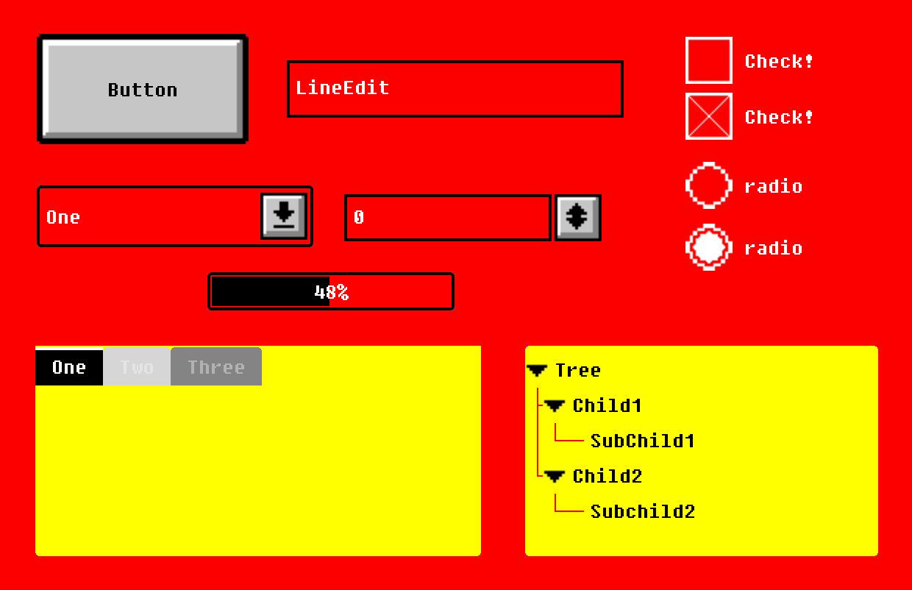
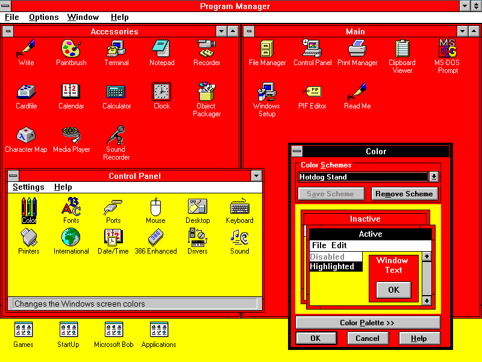

# Windows 3.1 "Hot Dog Stand" Theme for Godot 4.6

Want to experience productivity like never before?

Smear your Godot and your games with ketchup and mustard using the Hot Dog Stand theme for Windows 3.1!

## The Origin

The "Hot Dog Stand" theme first appeared in Windows 3.1 and demonstrated that the interface could adapt to any color scheme... even a terrible one. And they succeeded.

## What is this? Or rather... WHY?

This theme for Godot was born from a self-imposed challenge: to create a Godot theme, modifying the interface as much as possible, live on Twitch.

But really... it's a tribute.

A tribute to those brave souls who dare to go beyond the established norms simply "because I can."

A tribute to those who appreciate coherent ugliness, proving that if you find an interface ugly... you're probably uglier. There's no such thing as an ugly interface if it's coherent and useful.

## Do you expect anyone to use it in a non-ironic way?

Everything has its place and purpose... it just needs someone to find it.

Our intention is that this theme can completely replace the Godot interface, allowing you to create your own games with it. Perhaps not full games, but certainly those sections that simulate a retro PC from the early 90s.

Once the whole theme is done, we'll create a color "customizer" so it's easy to change without affecting the entire theme.

## Do you expect it to be included as a theme within Godot?

We'd love to be like Passivestar... but we doubt it will be included, not even as an Easter Egg: a theme takes up more resources than it seems, and considering that Godot is less than 160MB... every megabyte counts.

## License

MIT License

Copyright (c) 2024 Rafa Laguna [@rafalagoon](https://twitch.tv/rafalagoon)

Permission is hereby granted, free of charge, to any person obtaining a copy
of this software and associated documentation files (the "Software"), to deal
in the Software without restriction, including without limitation the rights
to use, copy, modify, merge, publish, distribute, sublicense, and/or sell
copies of the Software, and to permit persons to whom the Software is
furnished to do so, subject to the following conditions:

The above copyright notice and this permission notice shall be included in all
copies or substantial portions of the Software.

THE SOFTWARE IS PROVIDED "AS IS", WITHOUT WARRANTY OF ANY KIND, EXPRESS OR
IMPLIED, INCLUDING BUT NOT LIMITED TO THE WARRANTIES OF MERCHANTABILITY,
FITNESS FOR A PARTICULAR PURPOSE AND NONINFRINGEMENT. IN NO EVENT SHALL THE
AUTHORS OR COPYRIGHT HOLDERS BE LIABLE FOR ANY CLAIM, DAMAGES OR OTHER
LIABILITY, WHETHER IN AN ACTION OF CONTRACT, TORT OR OTHERWISE, ARISING FROM,
OUT OF OR IN CONNECTION WITH THE SOFTWARE OR THE USE OR OTHER DEALINGS IN THE
SOFTWARE.

### Why the MIT license?

Although I prefer FSF licenses (GPL/LGPL), in this case I believe this project can be used in both free/open source and privative projects.

If you make any changes, feel free to send them to me so I can include them and we can all benefit.
